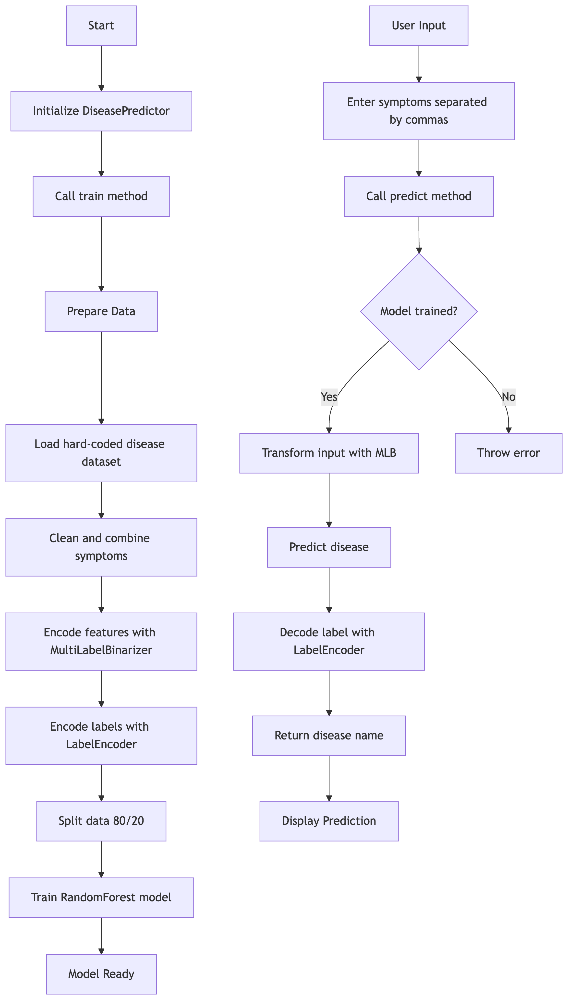

# DiseasePredictor

Overview
This machine learning system predicts diseases based on user-reported symptoms. Using a Random Forest classifier trained on symptom-disease relationships, it provides quick preliminary diagnoses. The system handles data preprocessing, feature encoding, and model training automatically.

Key Features
🩺 Symptom-based disease prediction

🧠 Random Forest machine learning model

🧹 Automatic data cleaning (handles missing values)

📋 Symptom vocabulary access

🧪 Built-in validation (20% test set)

🔄 Consistent feature encoding

System Design

Workflow Sequence

.png>)
